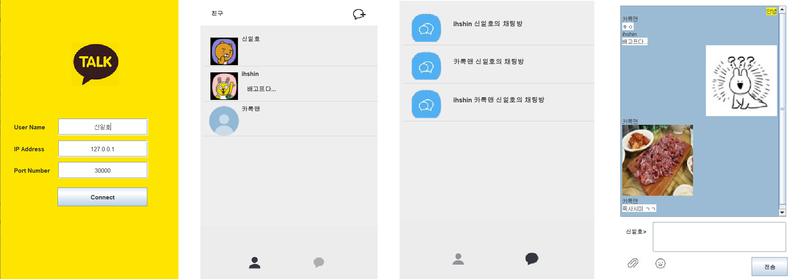

# 💬 멀티톡: 소켓 통신을 이용한 데스크톱 메신저

**설명:** 실시간 채팅을 위한 소켓 통신을 이용한 데스크톱 메신저 애플리케이션입니다. 텍스트 메시지, 이모티콘, 이미지 공유, 그룹 채팅을 지원합니다.

## 프로젝트 정보

- **개발 기간:** 2023-12-01 ~ 2023-12-23
- **개발 언어:** Java
- **개발 도구:** Eclipse

## 주요 기능

- 프로필 수정(사진, 상태 메시지)
- 채팅방 만들기(1:1 채팅, 그룹 채팅)
- 텍스트, 이모티콘, 이미지 전송

## 스크린샷

